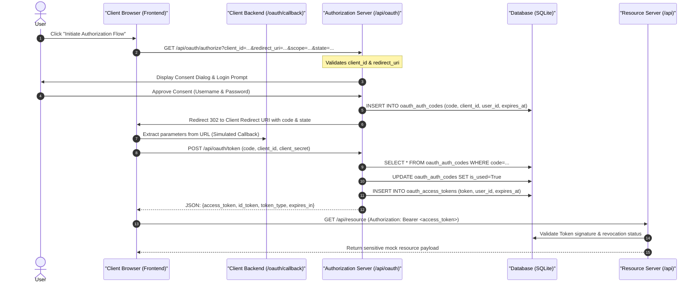

# OAuth 2.0 Playground & Sandbox

> A diagnostic environment for engineering, implementing, and visualizing the OAuth 2.0 Authorization Code Flow.

This playground serves as a fully interactive sandbox simulating the OAuth 2.0 protocol flow between the **Client Application**, the **Authorization Server (Identity Provider)**, and the **Resource Server**, with complete query tracing to an underlying **SQLite Database**.

---

## System Design & Architecture

The following sequence diagram outlines the interactive message exchanges and database interactions executed during the Authorization Code flow:



---

## Folder Structure

* [main.py](file:///home/ntirth005/Documents/Auth2Prod/src/main.py): Sets up the FastAPI app, manages database seeders, and routes HTTP requests.
* [models.py](file:///home/ntirth005/Documents/Auth2Prod/src/models.py): Defines tables for `User`, `OAuthClient`, `OAuthAuthCode`, and `OAuthAccessToken`.
* [database.py](file:///home/ntirth005/Documents/Auth2Prod/src/database.py): Exposes the SQLite engine and local DB session wrapper.
* [security.py](file:///home/ntirth005/Documents/Auth2Prod/src/security.py): Password hashing (PBKDF2) and stateless JWT signing/decoding utilities.
* [auth/oauth.py](file:///home/ntirth005/Documents/Auth2Prod/src/auth/oauth.py): Houses the API endpoint controllers and query tracking logger.
* [static/index.html](file:///home/ntirth005/Documents/Auth2Prod/src/static/index.html): HTML dashboard structure.
* [static/app.js](file:///home/ntirth005/Documents/Auth2Prod/src/static/app.js): Drives the flow client-side, parses tokens, and prints live logs.
* [static/style.css](file:///home/ntirth005/Documents/Auth2Prod/src/static/style.css): Dark theme UI styling matching the JWT Sandbox.

---

## The 5-Step Flow Details

1. **Step 1: Initiate Auth Request (`GET /api/oauth/authorize`)**
   - Configures the client metadata: `client_id`, `redirect_uri`, `scope`, and `state`.
   - Sends a validation request to verify the client exists in the SQLite database.
2. **Step 2: User Consent & Login (`POST /api/oauth/consent`)**
   - Prompts the user for resource owner credentials and displays the scopes requested.
   - Upon credentials verification and approval, writes a short-lived authorization code to the DB.
3. **Step 3: Capture Callback Code**
   - Parses parameters from the simulated redirect and displays the captured code and state values.
4. **Step 4: Token Exchange (`POST /api/oauth/token`)**
   - Sends a backend token exchange request including the authorization code and client secret.
   - Marks the code as used in the database to prevent replay attacks, issues stateless signed JWT Access and ID tokens, and saves token records to SQLite.
5. **Step 5: Resource Server Queries (`GET /api/resource` & `GET /api/oauth/userinfo`)**
   - Queries protected resource servers using the bearer Access Token.
   - Resource servers statically check the JWT signature and query the DB to verify the token has not been revoked.

---

## Resolved Challenges during Implementation

* **Console Log Loss on Redirect**: Standard OAuth 2.0 flows redirect the client browser back to the redirect URI, which reloads the page and wipes any browser console or network console timeline.
  - *Resolution*: We simulated the 302 redirect by intercepting the consent response, updating the browser URL bar inline using the HTML5 `history.pushState` API, and updating the state machine programmatically. This preserves the visual timeline log card history perfectly.
* **Out-of-the-box Preseeding**: Manually setting up test users and client applications slows down diagnostic exploration.
  - *Resolution*: Registered a FastAPI `startup` event listener that automatically checks and seeds a default test user (`alice` / `password123`) and a default registered OAuth Client (`mock-client-123` / `mock-client-secret-999`) on server boot.
* **Bcrypt / Passlib Version Mismatch**: Modern `bcrypt` versions (4.1.0+) combined with the unmaintained `passlib` package trigger a `ValueError` (password cannot be longer than 72 bytes) and `AttributeError` on start.
  - *Resolution*: Switched the hashing algorithm in `src/security.py` from `bcrypt` to `pbkdf2_sha256` which is natively supported by Python and does not rely on the faulty passlib-bcrypt backend glue code.

## Implementations Available

This repository houses two distinct implementations demonstrating the OAuth 2.0 Authorization Code flow:

### 1. Interactive Simulated Sandbox (`src/`)
- An educational playground simulating the handshake protocol (Authorization Server, Client, and Resource Server) to visualize step-by-step state mutations, JWT tokens, and database writes without registering credentials.
- **Run**:
  ```bash
  uv run uvicorn src.main:app --reload --port 8000
  ```
- **Access**: Open `http://localhost:8000/static/index.html`

### 2. Production-Grade Third-Party OAuth Identity App (`oauth_profile_app/`)
- Integrates with live, real-world Identity Providers (**GitHub** and **Google**) to authenticate users, map remote identities to local database profiles, and manage sessions statefully via HttpOnly JWT session cookies.
- For complete registration guides (both are **free**) and solutions to common redirect-state errors, see the dedicated [oauth_profile_app/README.md](file:///home/ntirth005/Documents/Auth2Prod/oauth_profile_app/README.md).
- **Run**:
  ```bash
  uv run uvicorn oauth_profile_app.main:app --reload --port 8000
  ```
- **Access**: Open `http://localhost:8000/static/index.html`