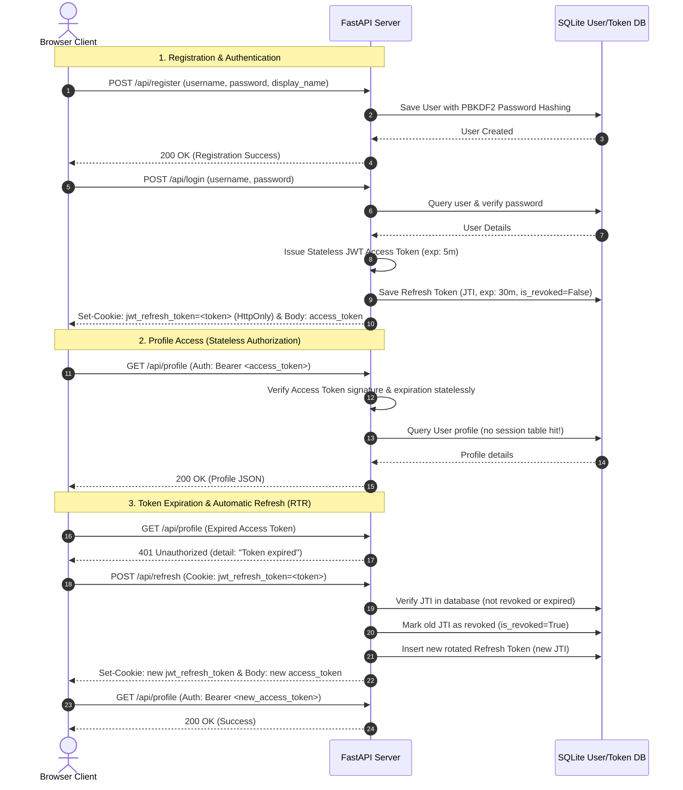

# Stateless JWT Profile & Session Management Application

This application demonstrates production-grade, stateless user authentication and profile management using **JSON Web Tokens (JWT)**, featuring **Refresh Token Rotation (RTR)** to secure API access and solve token invalidation challenges.

---

## 1. System Architecture & Flow



---

## 2. Database Schema

The SQLite database (`jwt_app.db`) automatically sets up the following schema:

### `users` Table
Stores user credentials and profile details.
| Column | Type | Attributes | Description |
| :--- | :--- | :--- | :--- |
| `id` | INTEGER | Primary Key, Autoincrement | Unique identifier for each user record. |
| `username` | VARCHAR | Unique, Index, Not Null | Unique username matching the login identifier. |
| `hashed_password` | VARCHAR | Not Null | Salted PBKDF2-SHA256 password hash. |
| `display_name` | VARCHAR | Nullable | User's public display name. |
| `email` | VARCHAR | Nullable | User's email address. |
| `bio` | VARCHAR | Nullable | User's biography text. |

### `refresh_tokens` Table
Tracks long-lived refresh tokens for revocation and rotation checks.
| Column | Type | Attributes | Description |
| :--- | :--- | :--- | :--- |
| `id` | INTEGER | Primary Key, Autoincrement | Unique database record ID. |
| `token_jti` | VARCHAR | Unique, Index, Not Null | Unique UUID (JTI claim in JWT) representing the token family. |
| `user_id` | INTEGER | Foreign Key (`users.id`), Cascade | Owner of the refresh token. |
| `created_at` | DATETIME | Not Null, Default UTC | Timestamp of token generation. |
| `expires_at` | DATETIME | Not Null | Expiration limit (30 minutes from creation). |
| `is_revoked` | BOOLEAN | Default False, Not Null | Revocation state. Set to True on rotation or password change. |

> [!NOTE]
> **Why Persist Revoked/Used Tokens in the Database?**
> Keeping rotated and revoked tokens in the database (instead of deleting them) is a critical industry security measure:
> 1. **Replay Detection:** If an attacker steals and attempts to use a previously rotated/used refresh token, the server queries the database, finds the JTI, and sees `is_revoked == True`.
> 2. **Active Mitigation:** Detecting a replayed token signals that a compromise has occurred. The server immediately invalidates the entire token family (revoking all refresh tokens for that user ID in the DB), forcing a global logout on all devices.
> 3. **The Parity Problem:** If revoked tokens were deleted from the database, the server would simply return a generic `401 Invalid Token` error on replay, missing the opportunity to detect the active compromise and lock down the user's account.

---

## 3. Stateful Sessions vs. Stateless JWTs: Architectural Comparison

| Dimension | Stateful Session Cookies | Stateless JWT + Refresh Tokens |
| :--- | :--- | :--- |
| **Verification State** | **Stateful:** Server must check database or caching layer (e.g. Redis) on every single request. | **Stateless:** Server validates Access Token signature mathematically without database hits. |
| **Storage Location** | Client: Cookie. Server: DB/Memory session store. | Client: Access Token in memory, Refresh Token in HttpOnly cookie. Server: No session state, only tracking table for refresh JTIs. |
| **Microservices Compatibility** | **Low:** Requires central shared cache/session store or sticky load balancers. | **High:** Any microservice possessing the public key can verify tokens independently. |
| **Instant Revocation** | **Easy:** Server deletes session ID from DB/Redis instantly ending the session. | **Difficult:** Instant revocation is impossible statelessly. Solved by short-lived Access Tokens (5m) + database Refresh check. |
| **Bandwidth/Header Overhead** | **Low:** Session ID cookie is a tiny string (~32 chars). | **Medium/High:** JWT contains full user claims + signatures, enlarging request header payloads. |

---

## 4. Runtime & Architectural Error Scenarios

### Runtime Errors & Handling
* **`ExpiredSignatureError`:**
  * *Cause:* Access token lifetime expired (exceeded 5 mins).
  * *Handling:* Backend returns `401 Unauthorized` with detail `"Token expired"`. The client interceptor catches this and executes `/api/refresh` to rotate tokens.
* **`InvalidSignatureError`:**
  * *Cause:* Token tampered with (payload changed in transit) or signed with a different key.
  * *Handling:* Reject request immediately with `401 Unauthorized`.
* **`InvalidTokenError`:**
  * *Cause:* Corrupt token format, wrong number of segments, or wrong algorithm.
  * *Handling:* Reject request immediately with `401 Unauthorized`.
* **Clock Drift:**
  * *Cause:* Discrepancy between client and server system clocks.
  * *Handling:* Server configures a small validation leeway (e.g., 10 seconds) during decode.
* **`Unlogged Token Actions / Missing Diagnostic State`:**
  * *Cause:* Generation endpoints failing to output request metadata or clients failing to invoke logging callbacks, causing silent transaction lifecycles.
  * *Handling:* Return a structured diagnostic `debug` payload from all generation and verification APIs and invoke the visual logging callback on success.

### Architectural Gotchas & Mitigations
* **Revocation Lag:**
  * *Risk:* If a user is compromised, their stateless Access Token remains valid until it naturally expires.
  * *Mitigation:* We use very short-lived access tokens (5 mins). For immediate global logouts (e.g., password change), we mark all user `refresh_tokens` as `is_revoked = True` in the database.
* **Token Storage Dilemma (XSS vs CSRF):**
  * *Risk:* Storing access tokens in `localStorage` exposes them to XSS attacks (malicious scripts stealing the token). Storing them in standard cookies exposes them to CSRF (forged cross-site calls).
  * *Mitigation:* Storing short-lived Access Tokens strictly in **JavaScript local memory** (lost on tab close/refresh) and the Refresh Token in a `HttpOnly`, `SameSite=Lax` cookie.
* **Secret Key Leakage:**
  * *Risk:* Compromising the signing secret allows attackers to forge any identity.
  * *Mitigation:* Store signing secrets in environment variables outside the source code, and implement periodic secret rotation.
* **Refresh Token Replay (Abuse):**
  * *Risk:* An attacker steals the refresh token cookie and tries to use it.
  * *Mitigation:* **Refresh Token Rotation (RTR)**. Every time a refresh token is used, it is revoked and replaced. If a revoked refresh token is submitted again, the server assumes a replay attack and revokes all refresh tokens in that user's family tree.

---

## 5. How to Run Locally

Start the server using `uv run`:
```bash
uv run uvicorn jwt_profile_app.main:app --port 8000 --reload
```
Navigate to your web browser:
👉 **[http://127.0.0.1:8000/static/index.html](http://127.0.0.1:8000/static/index.html)**
