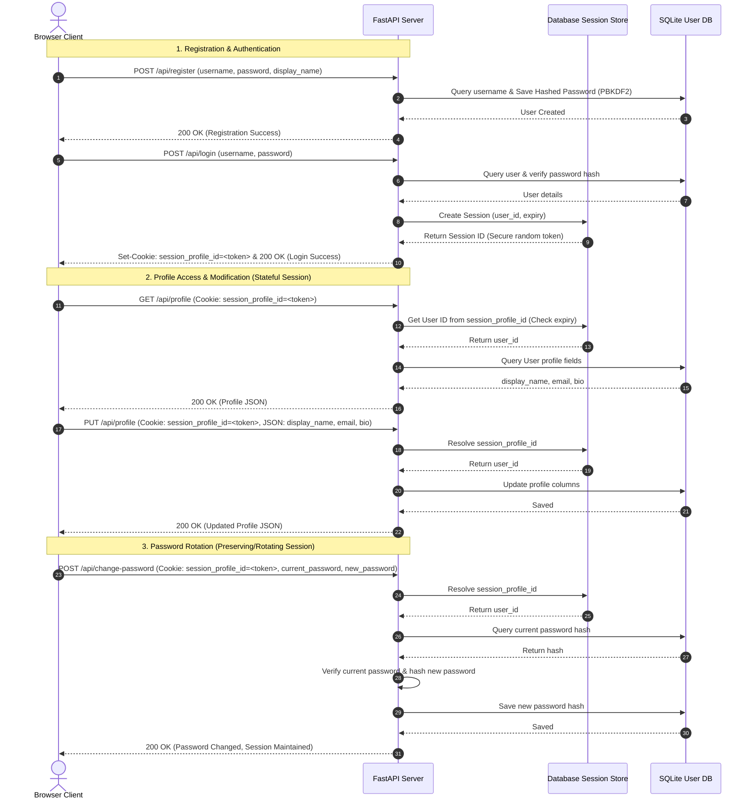

# Stateful User Session & Profile Management Application

This is a production-style user account management application built in Python using FastAPI, SQLAlchemy, and SQLite. It demonstrates standard authentication and stateful session lifecycles, allowing users to register profiles, establish cookie-based sessions, modify profile details, and rotate passwords.

---

## 1. System Architecture & Flow



---

## 2. Database Schema

The SQLite schema is automatically established by SQLAlchemy in `session_app.db` under the following structure:

### `users` Table
Stores user credentials and profile details.
| Column | Type | Attributes | Description |
| :--- | :--- | :--- | :--- |
| `id` | INTEGER | Primary Key, Autoincrement | Unique identifier for each user record. |
| `username` | VARCHAR | Unique, Index, Not Null | Unique username matching the login identifier. |
| `hashed_password` | VARCHAR | Not Null | Salted PBKDF2-SHA256 password hash. |
| `display_name` | VARCHAR | Nullable | User's public display name. |
| `email` | VARCHAR | Nullable | User's validated email address. |
| `bio` | VARCHAR | Nullable | User's profile summary bio text. |
| `salt` | VARCHAR | Nullable | Hex string salt used in client-side password hashing. |
| `client_key` | VARCHAR | Nullable | SHA-256 hash of password + salt (for cryptographic auth). |

### `session_records` Table
Stores active stateful session IDs and expiry limits.
| Column | Type | Attributes | Description |
| :--- | :--- | :--- | :--- |
| `id` | INTEGER | Primary Key, Autoincrement | Unique record ID. |
| `session_id` | VARCHAR | Unique, Index, Not Null | Secure url-safe random session ID string. |
| `user_id` | INTEGER | Foreign Key (`users.id`), Cascade | Owner of the session. |
| `created_at` | DATETIME | Not Null, Default UTC | Timestamp of session establishment. |
| `expires_at` | DATETIME | Not Null | Expiration limit (15 minutes from creation). |

### `login_challenges` Table
Manages temporary single-use nonces to secure cryptographic logins.
| Column | Type | Attributes | Description |
| :--- | :--- | :--- | :--- |
| `id` | INTEGER | Primary Key, Autoincrement | Unique record ID. |
| `username` | VARCHAR | Not Null | User requesting authentication. |
| `nonce` | VARCHAR | Unique, Index, Not Null | Random single-use challenge token. |
| `created_at` | DATETIME | Not Null, Default UTC | Timestamp of challenge creation. |
| `expires_at` | DATETIME | Not Null | Token lifetime expiration (2 minutes). |

---

## 3. Session Security Best Practices Implemented

* **Password Hashing (PBKDF2-SHA256)**: Rather than storing cleartext passwords or fast MD5/SHA-256 digests (which are easily cracked via GPUs), the application utilizes **PBKDF2 with SHA-256** internally to salt and compute slow password hashes, defending against brute-force table lookups.
* **Token Entropy**: Session IDs are generated using Python's `secrets` module (`secrets.token_urlsafe(32)`), producing high-entropy keys that prevent brute-force token prediction.
* **Session Invalidation on Password Change**: When a user updates their password, all *other* active session records for that user are deleted from the database. This guarantees that if a session was hijacked on another device, the hijacker is instantly forced out upon password rotation.
* **Cookie Protection Flags**:
  * `HttpOnly`: Prevents client-side scripts (e.g. malicious XSS) from reading the `session_profile_id` cookie via `document.cookie`.
  * `SameSite=Lax`: Restricts cookie transmission on cross-site requests, mitigating Cross-Site Request Forgery (CSRF).
  * *Production Note*: In local staging, the `Secure` flag is omitted for plain HTTP support, but it should be set to `True` in production to restrict cookie transport strictly to HTTPS tunnels.

---

## 4. Zero-Password-Transmission Cryptographic Handshake

### What It Does:
Instead of transmitting the user's cleartext password over the wire during standard HTTP logins, this application implements a custom **Challenge-Response** authentication handshake:
1. **Registration**: The server generates a unique user-specific `salt` and stores `client_key = SHA256(password + salt)`.
2. **Challenge Request**: The client requests a challenge nonce: `POST /api/auth/challenge` `{ username }`.
3. **Challenge Generation**: The server stores a single-use random `nonce` in the database and returns the nonce and the user's registration `salt` to the client.
4. **Signature Generation**: The client computes:
   * `client_key = SHA256(password + salt)`
   * `auth_hash = SHA256(client_key + nonce)`
5. **Verification**: The client submits the `auth_hash` signature. The server deletes the single-use nonce to prevent replay attacks, computes the expected hash from the database-stored `client_key`, and logs the user in if they match.

### Why:
* **Wire Confidentiality**: Even if TLS/HTTPS gets decrypted or bypassed (e.g. compromised root CA or proxy sniffing), the password itself is never transmitted across the network.
* **Replay Attack Resistance**: Because the server-issued `nonce` changes on every request and is immediately destroyed upon verification, a packet sniffer cannot reuse the captured signature to authenticate.

---

## 5. Structured JSON & Plaintext Logging (Observability)

### What It Does:
The application implements two parallel logging strategies for professional debugging and monitoring:
1. **JSON Log Output (`session_app.log`)**: Format output as parsed single-line JSON records containing UTC timestamps, logger paths, log levels, correlation IDs, and custom event context properties.
2. **Plaintext Log Output (`session_app_simple.log`)**: Outputs human-readable string summaries of identical events.
3. **Request Correlation ID Middleware**: Assigns a unique UUID to every incoming HTTP request and binds it to log lines via asynchronous thread local state (`contextvars`).

### Why:
* **Automated Log Ingestion**: System aggregators (ELK, Datadog, Splunk) can parse the JSON log files directly, allowing engineers to query fields instantly.
* **Concurrent Transaction Tracking**: Since web request logs interleave in parallel environments, filtering by the request's specific Correlation ID allows developers to rebuild the full transaction lifecycle step-by-step.

---

## 6. Enterprise Modular Directory Restructuring

### What It Does:
To scale the application from a single-file sandbox into a production-grade codebase, we refactored the backend into modular, domain-driven layers:

#### A. Core Application Layer (`core/`)
* **`core/config.py`**: Manages environment variables and global configurations (database URLs, session durations, cookie names) in a single configuration settings class.
* **`core/database.py`**: Sets up the SQLAlchemy database engine, session makers, and holds the `get_db` generator dependency.
* **`core/logging.py`**: Configures the structured logger handlers, including JSON formatting (for automated aggregators), human-readable simple text outputs, and async context tracking.
* **`core/security.py`**: Encapsulates cryptographic verification algorithms using PBKDF2-SHA256 password contexts.
* **`core/session.py`**: Implements the `DatabaseSessionManager` class to create, validate, and revoke user sessions.

#### B. API Domain Controllers (`api/`)
* **`api/auth.py`**: Routes authentication-specific endpoints, including registration (`/api/register`), standard login (`/api/login`), challenge creation (`/api/auth/challenge`), signature verification (`/api/auth/challenge-login`), and logout (`/api/logout`).
* **`api/profile.py`**: Houses endpoint handlers for profile reading (`/api/profile`), updates, and credential rotation (`/api/change-password`).
* **`api/debug.py`**: Directs dashboard telemetry, providing raw table state dumps (`/api/debug/state`) and database resets (`/api/debug/reset`).
* **`api/utils.py`**: Implements shared dependencies and routing utility functions (such as `get_current_user` and `capture_debug_meta`).

#### C. Data Models & Validations (`models/` & `schemas/`)
* **`models/models.py`**: Houses SQLAlchemy declarative ORM models defining SQLite schemas for users, sessions, and challenges.
* **`schemas/schemas.py`**: Holds Pydantic validation schemas to enforce strict type checking and API payload constraints at the HTTP boundary.

#### D. App Orchestrator (`main.py`)
* Acts as the application bootstrapper: instantiates the FastAPI framework, runs database table migrations, hooks up request logging middleware, and includes all API routers.

### Why:
* **Separation of Concerns**: System components are highly decoupled. Changing the password hashing algorithms (in `core/security.py`) or database engine configurations (in `core/database.py`) does not require editing endpoint handlers.
* **Scalability & Team Collaboration**: Multiple developers can build new database tables, routes, and validation schemas concurrently without merging conflicts.
* **Testability**: Decoupled modules allow unit testing of core utilities (like hashing or session resolution) independently from FastAPI HTTP router contexts.

---

## 7. How to Run Locally

Start the server using `uv run`:
```bash
uv run uvicorn session_profile_app.main:app --port 8000 --reload
```
Navigate to your web browser:
👉 **[http://127.0.0.1:8000/static/index.html](http://127.0.0.1:8000/static/index.html)**

---

## 8. HTTP vs. HTTPS Authentication Security Comparison

| Security Dimension | HTTP (Insecure Transfer) | HTTPS (Encrypted TLS/SSL) |
| :--- | :--- | :--- |
| **Data Transmission** | Sent in cleartext (anyone on the network path can read packets). | Encrypted payload (e.g. AES/ChaCha) using keys negotiated via TLS. |
| **Man-in-the-Middle (MITM)** | Highly vulnerable. Attackers can sniff or alter login credentials, session IDs, and profile details. | Safe. Prevents eavesdropping, tampering, and message forgery. |
| **`Secure` Cookie Flag** | **Ignored/Discarded by Browsers**. To protect security, browsers discard cookies with the `Secure` flag on plain HTTP connections. | **Persisted & Attached**. Browsers store and automatically send the cookie, restricting transmission strictly to HTTPS. |
| **Header Exposure** | Basic Auth credentials (`Authorization: Basic ...`) and API keys are transmitted as plain strings. | Headers and query arguments are wrapped in the TLS layer, protecting them from sniffers. |
| **Browser Indicator** | Displays "Not Secure" warning in the browser address bar. | Displays a padlock icon (🔒) indicating the connection is verified and encrypted. |
| **Sandbox Sim Impact** | Turning the **Secure Cookie Flag** toggle **ON** causes the browser to reject the cookie, logging you out immediately. | If running on HTTPS, turning the **Secure Cookie Flag** toggle **ON** works seamlessly, protecting the session. |

---

## 9. Recommended Git Commit Flow (Modular Stages)

To maintain a clean, readable Git history during this transition, commit changes incrementally using Conventional Commit messages:

### Stage 0: Project Environment & Gitignore
```bash
git add pyproject.toml uv.lock .gitignore && git commit -m "chore: configure project dependencies and database exclusions in gitignore"
```

### Stage 1: Logging Infrastructure & Config
```bash
git add session_profile_app/core/__init__.py session_profile_app/core/config.py session_profile_app/core/logging.py && git commit -m "feat(core): add configuration parameters and structured JSON & plaintext logger handlers"
```

### Stage 2: Database & Cryptographic Security
```bash
git add session_profile_app/core/database.py session_profile_app/core/security.py session_profile_app/core/session.py && git commit -m "feat(core): add database engine factories, PBKDF2 helpers, and session managers"
```

### Stage 3: Models & Request Validation Schemas
```bash
git add session_profile_app/models/ session_profile_app/schemas/ && git commit -m "feat(data): define database entities and validation schemas"
```

### Stage 4: API Domain Controllers
```bash
git add session_profile_app/api/ && git commit -m "feat(api): modularize auth, profile, and debug endpoint routers"
```

### Stage 5: Entrypoint Refactor & Purge Legacy Files
```bash
git add session_profile_app/main.py && git add -u && git commit -m "refactor: clean up FastAPI main.py entrypoint and purge legacy root files"
```

### Stage 6: Frontend Controls, Tests & Documentation
```bash
git add session_profile_app/verify_session_app.py session_profile_app/industry_logging.md session_profile_app/static/ session_profile_app/README.md && git commit -m "docs: add challenge auth UI toggle, test suite, and architectural guides"
```
