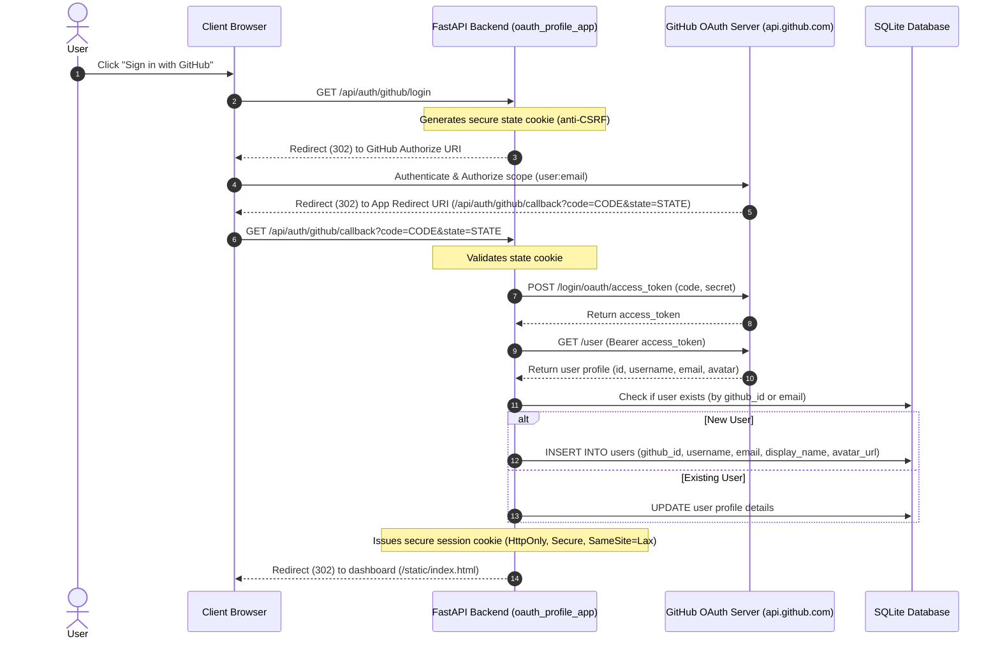

# Production-Grade Third-Party OAuth 2.0 Identity Portal

This application demonstrates a production-grade implementation of **third-party federated authentication** using **GitHub OAuth** and **Google OAuth** Identity Providers (IdPs).

---

## System Design & Proposed Architecture

The application communicates with external third-party authorization servers to authenticate users and maps their remote credentials to local SQLite profiles.



---

## Features
1. **Federated Identity Mapping**: Allows logging in via both GitHub and Google credentials, binding them to a single SQLite user profile.
2. **Secure Session Cookie Management**: Implements JWT-signed HttpOnly stateful cookies (`oauth_session`) to keep users securely authenticated locally.
3. **Double Anti-CSRF Protection**: Verifies transient secure state cookies on callbacks (`github_oauth_state` and `google_oauth_state`) to prevent Cross-Site Request Forgery attacks.
4. **Editable Local Profile Metadata**: Allows authenticated users to customize their display name, email, and bio stored in the local SQLite engine.
5. **Sandbox Storage Diagnostics Console**: Shows outgoing headers, SQLite database actions executed on logins/updates, and incoming headers in real-time.

---

## Configuration & Credentials Setup

Creating developer accounts and registering OAuth client applications on both GitHub and Google is **100% free**.

### 1. Registering App Credentials

#### A. GitHub OAuth Setup (Free)
1. Navigate to GitHub: **Settings** -> **Developer settings** -> **OAuth Apps** -> **New OAuth App**.
2. Populate the form fields:
   - **Application Name**: `Auth2Prod OAuth App`
   - **Homepage URL**: `http://localhost:8000`
   - **Authorization callback URL**: `http://localhost:8000/api/auth/github/callback`
3. Click **Register application**.
4. Copy your **Client ID**.
5. Click **Generate a new client secret** and copy it.

#### B. Google OAuth Setup (Free)
1. Go to the [Google Cloud Console](https://console.cloud.google.com/).
2. Create a new project (free).
3. Navigate to **APIs & Services** -> **OAuth consent screen**:
   - Choose **External** user type, click **Create**, and supply basic contact emails.
4. Go to **Credentials** -> **Create Credentials** -> **OAuth client ID**:
   - **Application type**: Web application
   - **Authorized JavaScript origins**: `http://localhost:8000`
   - **Authorized redirect URIs**: `http://localhost:8000/api/auth/google/callback`
5. Click **Create** and copy your **Client ID** and **Client Secret**.

### 2. Local Environment Configuration

Duplicate `.env.example` into a local `.env` file inside the `oauth_profile_app/` directory and populate your credentials:

```env
SECRET_KEY=prod-oauth-app-secret-key-999-secure

# GitHub OAuth credentials
GITHUB_CLIENT_ID=your_github_client_id_here
GITHUB_CLIENT_SECRET=your_github_client_secret_here

# Google OAuth credentials
GOOGLE_CLIENT_ID=your_google_client_id_here
GOOGLE_CLIENT_SECRET=your_google_client_secret_here
```

---

## Troubleshooting: "Invalid state parameter. CSRF validation failed"

If you encounter this error during callback redirects:

1. **Host/Domain Mismatch**: If you visit the app at `http://127.0.0.1:8000/`, cookies are bound to `127.0.0.1`. When redirected back to `http://localhost:8000/...`, the browser blocks the cookie transmission due to domain boundary segregation, failing the anti-CSRF check.
   - **Solution**: Access the application exclusively at **`http://localhost:8000/`** (matching the Redirect URI host).
2. **Expired Cookie**: The anti-CSRF state cookie has a lifespan of 5 minutes.
   - **Solution**: Re-initiate the flow.


---

## Resolved Challenges during Implementation

* **CSRF Validation Failures on Callback Redirects**: During testing, the browser returned an `Invalid state parameter` error when redirected back from the third-party providers.
  - *Cause*: FastAPI's default `set_cookie` assigns the path of the current endpoint setting the cookie (e.g. `/api/auth/github/login`). Consequently, the browser did not send the cookie back to the callback endpoint (`/api/auth/github/callback`) since it was outside the cookie's path scope.
  - *Resolution*: Explicitly set `path="/"` in all `response.set_cookie` and `response.delete_cookie` calls, ensuring they are shared globally across the domain scope.
* **Host/Domain Mismatch (localhost vs 127.0.0.1) on Callbacks**:
  - *Cause*: Starting the application and browsing on `http://127.0.0.1:8000` sets state cookies on the `127.0.0.1` domain. If the configured `GITHUB_REDIRECT_URI` or `GOOGLE_REDIRECT_URI` points to `http://localhost:8000/...`, the user will be redirected back to `localhost:8000` on successful authorization. Because `127.0.0.1` and `localhost` are distinct origins in the browser, the browser will not send the state cookie, resulting in a CSRF validation failure.
  - *Resolution*: Ensure you are browsing the application using the *exact* same hostname/domain as the configured redirect URI (typically `http://localhost:8000`). The backend now includes host verification checks and warnings on login initiation, plus detailed console diagnostics on callback failures to help debug these configurations.
* **FastAPI/Starlette Response Cookie Discard Gotcha on Redirects**:
  - *Cause*: In FastAPI/Starlette, when you request a dependency injection of `response: Response` in your route parameters, FastAPI prepares a default `Response` object. Calling `response.set_cookie(...)` modifies the headers *only on that injected default response*. If the route function returns a **custom response subclass directly** (like `return RedirectResponse(...)` or `return JSONResponse(...)`), Starlette handles the custom returned response directly and **discards the injected default response object entirely**, meaning any cookies/headers bound to it are lost and never serialized into the HTTP response.
  - *Why it only works for serialized payloads*: If the route returns a standard Python type (like a dict or a Pydantic model), FastAPI handles the serialization itself. During this process, it dynamically copies the headers/cookies from the injected default `response` parameter to the newly generated `JSONResponse`. Returning a custom Response directly bypasses this copying stage.
  - *Resolution*: Instantiated the `RedirectResponse` first, and then explicitly set the cookie on that redirect response object before returning it (e.g. `redirect_res = RedirectResponse(...)`, `redirect_res.set_cookie(...)`, `return redirect_res`).

---


## Running the Application

Ensure dependencies (`httpx` and `python-dotenv`) are installed:
```bash
uv pip install -e .
```

Start the application on port 8000:
```bash
uv run uvicorn oauth_profile_app.main:app --reload --port 8000
```
Open http://localhost:8000 in your browser to experience the third-party OAuth portal!
